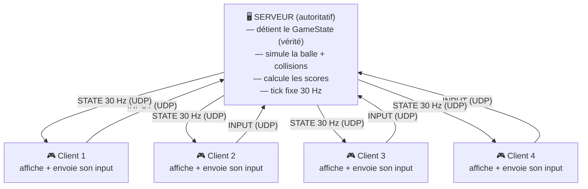
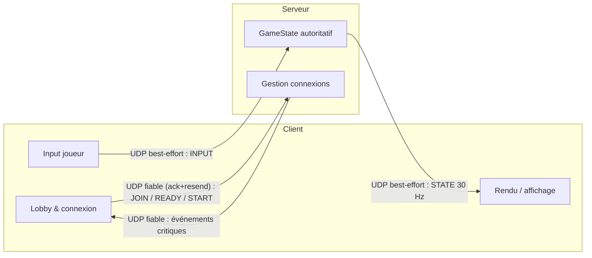
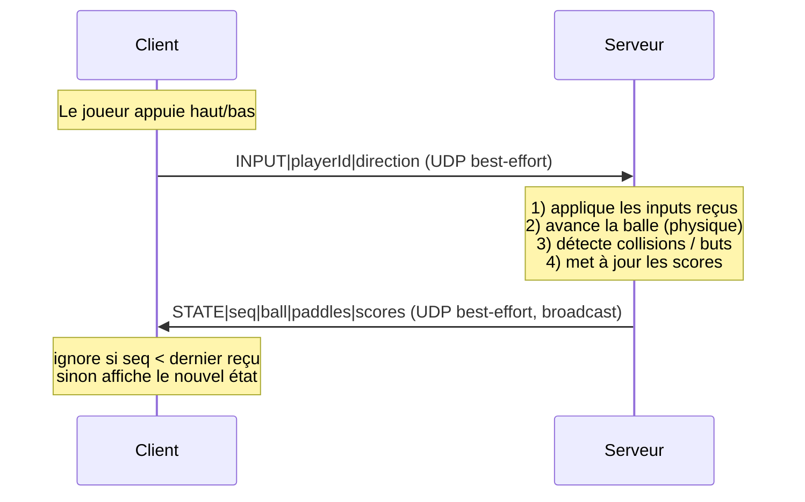
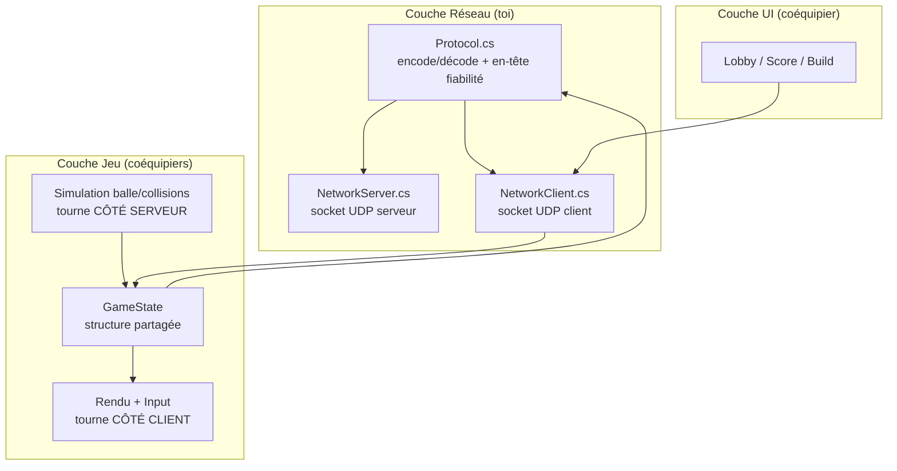

# Architecture réseau — MMPong

> Schéma d'architecture du projet. Les diagrammes sont en [Mermaid](https://mermaid.js.org/)
> et se rendent automatiquement sur GitHub.

## 1. Topologie : Client-Serveur autoritatif

Un **serveur** détient l'unique vérité de l'état du jeu. Les clients n'affichent
que ce que le serveur leur envoie, et ne remontent que l'input du joueur.



**Pourquoi ce choix** (paradigme « dumb client » du cours) :
- Une seule source de vérité → pas de désaccord entre clients sur la position de la balle.
- La physique partagée (balle) est simulée **une seule fois**, sur le serveur.
- Les conflits (race conditions) sont arbitrés par le serveur en *first-come, first-served*.

> Pour la démo, le serveur est hébergé par un joueur (**client-host**) : une seule
> instance fait à la fois serveur ET client local. Plus simple à déployer en 10 jours.

## 2. Transport unique : UDP avec deux canaux logiques

**Tout passe par UDP, sur un seul socket et un seul port.** Un octet d'en-tête dans
chaque message indique son niveau de fiabilité. C'est l'approche des vraies libs de
netcode (ENet, GameNetworkingSockets, QUIC) : un seul tuyau, plusieurs « canaux ».



En-tête de message :

```
[type] [reliable] [seq] [payload...]
   │        │        │
   │        │        └─ numéro de séquence
   │        └─ 0 = best-effort (STATE/INPUT) | 1 = fiable (START/END/JOIN)
   └─ type de message
```

| Canal logique | Fiabilité | Contenu | Pourquoi |
|---------------|-----------|---------|----------|
| **État de jeu** | best-effort (`reliable=0`) | positions balle/paddles, scores (30 msg/s) | On veut le paquet le **plus frais**, pas la fiabilité. La perte est OK (le suivant corrige). |
| **Événements** | fiable (`reliable=1`) | connexion, « prêt », démarrage, fin de partie | Rares mais **critiques** : la perte est inacceptable. Géré par **ack + ré-émission** (~30 lignes). |

> **Pourquoi UDP-only et pas un hybride TCP/UDP** : un seul socket, un seul port
> (déploiement internet trivial), un seul modèle mental, pas de *framing* TCP à gérer.
> La fiabilité des rares événements critiques tient en une petite couche ack/resend
> custom — ce qui rapporte aussi les points « protocole custom » et « race conditions ».
>
> **Repli** : si la couche fiable se révèle galère près de la deadline, ajouter un
> socket TCP juste pour le lobby en filet de secours.

## 3. Boucle de synchronisation (1 tick serveur)



## 4. Couches de code (séparation des responsabilités)



> **Le contrat `GameState` est la frontière.** Tant que chaque couche le respecte,
> les travaux de chacun se branchent sans friction. Voir `specification.md`.

## 5. Fluidité & scalabilité (note)

Le serveur autoritatif introduit une latence (aller-retour vers le serveur). Ce n'est
pas un bug mais de la physique : on ne la supprime pas, on la **cache** côté client.
**Autorité** (qui détient la vérité) et **affichage** (ce qu'on rend tout de suite)
sont deux axes séparés — on garde l'autorité serveur ET on rend fluide via :

- **Interpolation** des objets distants (balle, paddles) entre deux snapshots → mouvement lisse malgré 30 Hz.
- **Client-side prediction** de son propre paddle → zéro latence ressentie sur ses actions.
- **Reconciliation** : correction douce quand la vérité serveur contredit la prédiction.

À grande échelle, le goulot n'est pas l'autorité mais la **bande passante** (état en N²) :
delta compression, encodage binaire, interest management. Pour 4 joueurs, inutile —
interpolation + prediction suffisent (barreau 9 de la roadmap).
